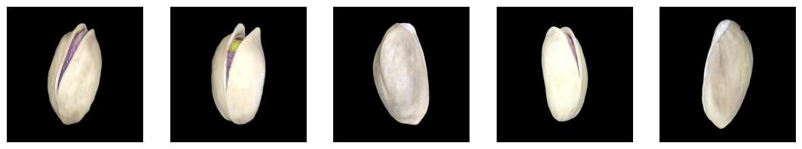

# 🧼 Image Denoising using Convolutional Autoencoder

This project focuses on developing a **Deep Learning Autoencoder** to remove **Gaussian noise** from images.  
The goal is to train a neural network capable of restoring clean images from noisy inputs, demonstrating how autoencoders can be applied for **image enhancement and reconstruction** in real-world computer vision tasks.

---

## 📘 Overview

Noise in digital images can significantly degrade quality and hinder visual recognition.  
In this project, a **Convolutional Autoencoder (CAE)** was built to denoise images containing Gaussian noise (mean = 0.0, std = 0.1).  
Two models were compared:
- **Baseline Autoencoder** (simple architecture)
- **Modified Autoencoder** (enhanced depth, Batch Normalization, Dropout, and hybrid loss)

---

## 🧠 Dataset Overview

The dataset contains **1,075 grayscale images** of white seashells on a black background.  
To simulate noisy data, Gaussian noise was artificially added using: np.random.normal(0, 0.1, image.shape)

### Dataset Split
| Set | Percentage | Purpose |
|------|-------------|-----------|
| **Training** | 80% | Model learning |
| **Validation** | 10% | Hyperparameter tuning |
| **Testing** | 10% | Model evaluation |

---

## 🔍 Exploratory Data Analysis (EDA)

EDA was performed to understand the image characteristics before training:
- **Histogram analysis** — Checked pixel intensity distributions to identify brightness and contrast ranges.  
- **Image visualization** — Observed texture, lighting uniformity, and structure of the shell object.  
- **Noise simulation** — Applied Gaussian noise to verify realism and complexity of generated noisy data.

> EDA ensures that the preprocessing pipeline and model architecture are well-suited to the image characteristics and noise type.

---

## ⚙️ Model Architecture

### 🧩 Baseline Autoencoder
Implemented using **Conv2D** and **MaxPooling2D** layers to encode features, followed by **UpSampling2D** for decoding.

| Layer | Type | Output Shape |
|--------|------|--------------|
| Input | InputLayer | (100, 100, 3) |
| Encoder | Conv2D + MaxPooling2D | (25, 25, 64) |
| Decoder | Conv2D + UpSampling2D | (100, 100, 3) |
| Activation | ReLU (Sigmoid on output) | - |

**Optimizer:** Adam  
**Loss:** Mean Squared Error (MSE)

---

### ⚡ Modified Autoencoder
Enhanced with:
- Additional **Conv2D** layers for deeper feature extraction  
- **Batch Normalization** and **Dropout** for improved regularization  
- Combined **Loss Function**: `0.5 * MSE + 0.5 * (1 - SSIM)`  
- Tuned learning rate for stable convergence  

This modified design enables the model to better retain structural and textural details during reconstruction.

---

## 📈 Model Evaluation

### 🔹 Structural Similarity Index (SSIM)

**Analysis:**
- The **baseline model** struggled to reconstruct fine details, with significant loss of structure and clarity.  
- The **modified model** achieved a **drastic improvement (SSIM = 0.9218)**, successfully preserving edges and overall object texture.  

### 🖼️ Visual Comparison

> The modified autoencoder produced visually cleaner, sharper images, effectively suppressing Gaussian noise while maintaining object boundaries.

---

## 🧾 Conclusion

- The **Convolutional Autoencoder** proved effective in denoising Gaussian noise from real-world images.  
- **Architectural modifications** (BatchNorm, Dropout, and hybrid loss) significantly improved image reconstruction quality.  
- Achieved **SSIM = 0.9218**, showing near-perfect similarity to the original image.  

✅ This project demonstrates the capability of **deep learning models for low-level vision tasks**, such as **image restoration, enhancement, and noise reduction**.
